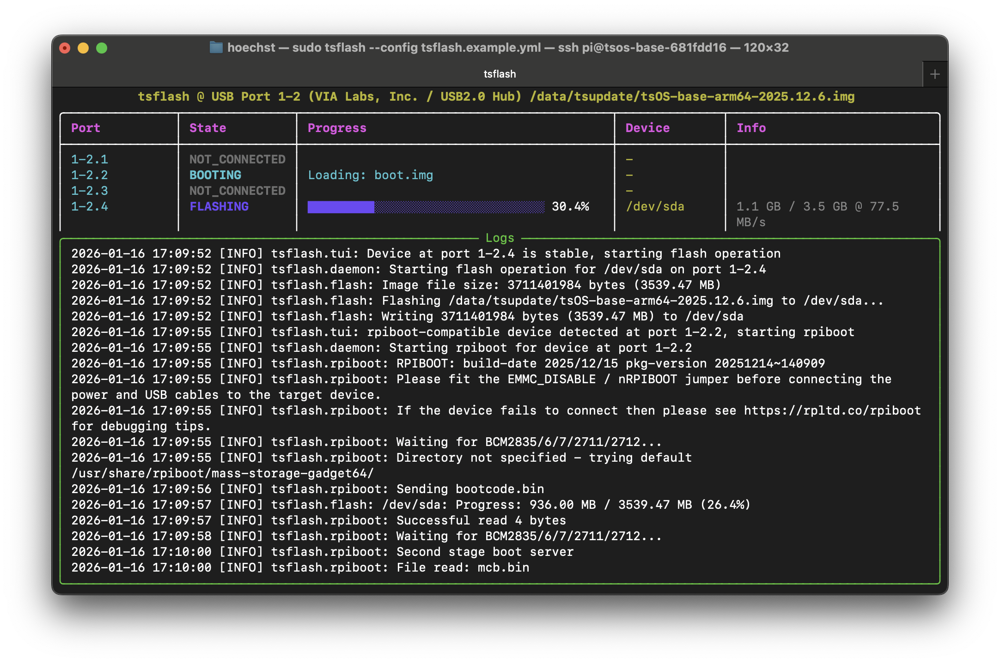

# tsflash

**SD Card Flashing Tool for Raspberry Pi**

tsflash is a powerful Python tool for flashing OS images to SD cards and other block devices. It features an interactive TUI for real-time monitoring and automatic device flashing, along with a comprehensive CLI for manual operations.

## TUI - Interactive Monitoring

The default mode provides a beautiful terminal-based interface for monitoring USB ports and automatically flashing connected devices:



The TUI displays:
- **Real-time port status** - Monitor all USB downstream ports with color-coded states
- **Live progress tracking** - Watch flash operations with progress bars, transfer speeds, and completion status
- **Automatic device detection** - Automatically detects and flashes devices as they're connected
- **Parallel flashing** - Flash multiple devices simultaneously
- **Log panel** - View detailed operation logs in real-time

Simply run `tsflash` (without arguments) to launch the TUI mode.

## Features

- **Interactive TUI** - Default mode with real-time monitoring and progress visualization
- **CLI Commands** - Manual control with `flash`, `usb`, `daemon`, and `rpiboot` subcommands
- **Automatic Device Detection** - Monitors USB hubs and automatically flashes connected devices
- **Raspberry Pi rpiboot Support** - Boot Raspberry Pi devices into mass storage mode for flashing
- **Parallel Flashing** - Flash multiple devices simultaneously using memory-mapped images
- **Efficient I/O** - Uses memory-mapped files for fast, parallel access to image files

## Installation

tsflash requires Python 3.7 or higher.

Install dependencies:
```bash
pip install tqdm pyyaml rich
```

Or install the package:
```bash
pip install .
```

## Quick Start

### TUI Mode (Default)

The simplest way to use tsflash is to run it without arguments, which launches the interactive TUI:

```bash
tsflash
```

The TUI will:
1. Load configuration from `/boot/firmware/tsflash.yml` (or specify with `--config`)
2. Auto-detect the first USB hub to monitor
3. Display all downstream ports in real-time
4. Automatically flash devices as they're connected

### Manual Flash Command

Flash an image to a specific device:

```bash
sudo tsflash flash /path/to/image.img /dev/sda
```

### Configuration

Create a configuration file at `/boot/firmware/tsflash.yml` (or use `tsflash.example.yml` as a template):

```yaml
# Path to the image file to flash
image_path: /data/images/raspberry-pi-os.img

# USB port to monitor (optional - auto-detects first hub if not specified)
# port: 1-2

# Block size for flashing (default: 4M)
block_size: 4M

# Seconds to wait after device appears before flashing (default: 3)
stable_delay: 1

# Logging level (default: INFO)
log_level: INFO
```

## Usage

### TUI Mode

Run without arguments to launch the interactive TUI:

```bash
tsflash [--config /path/to/config.yml]
```

The TUI automatically:
- Monitors USB ports for connected devices
- Detects block devices and rpiboot-compatible devices
- Flashes devices using the configured image
- Displays real-time progress and logs

Press `Ctrl+C` to gracefully shutdown.

### CLI Commands

#### Flash

Manually flash an image to a block device:

```bash
tsflash flash <image_file> <block_device> [--block-size 4M] [--non-interactive]
```

Examples:
```bash
sudo tsflash flash raspberry-pi-os.img /dev/sda
sudo tsflash flash image.img /dev/mmcblk0 --block-size 1M
```

#### USB

List USB ports and connected devices:

```bash
tsflash usb [--all] [--port 1-2] [--json]
```

- `--all` - Show all USB ports (default: first hub and downstream ports)
- `--port` - Limit output to a specific port and downstream ports
- `--json` - Output in JSON format

#### Daemon

Run the automatic flashing daemon (background service):

```bash
tsflashd [--config /path/to/config.yml]
```

The daemon runs continuously, monitoring USB ports and automatically flashing devices. Useful for production environments where the TUI isn't needed.

#### rpiboot

Boot a Raspberry Pi device into mass storage mode:

```bash
tsflash rpiboot [-p 1-2.3] [--verbose]
```

This is useful for flashing Raspberry Pi devices that don't have an SD card inserted.

## Configuration

Configuration is stored in a YAML file (default: `/boot/firmware/tsflash.yml`). See `tsflash.example.yml` for a complete example.

**Key Settings:**

- `image_path` (required) - Path to the OS image file (.img or .iso)
- `port` (optional) - USB port to monitor (e.g., "1-2"). Auto-detects first hub if not specified
- `block_size` (optional) - Block size for reading/writing (default: "4M"). Examples: "4M", "1M", "512K"
- `stable_delay` (optional) - Seconds to wait after device detection before flashing (default: 3)
- `log_level` (optional) - Logging level: DEBUG, INFO, WARNING, ERROR, CRITICAL (default: INFO)

## Commands Reference

| Command | Description |
|---------|-------------|
| `tsflash` | Launch interactive TUI (default mode) |
| `tsflash flash <file> <device>` | Manually flash an image to a block device |
| `tsflash usb` | List USB ports and connected devices |
| `tsflash daemon` | Run automatic flashing daemon (background service) |
| `tsflash rpiboot` | Boot Raspberry Pi into mass storage mode |

## Requirements

- Python 3.7+
- tqdm >= 4.64.0
- pyyaml >= 6.0
- rich >= 13.0.0

## License

[Add license information if applicable]
